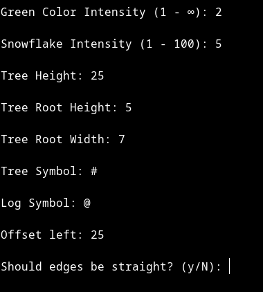

# Christmas Tree Console Generator

## Overview
This is a simple console-based Christmas tree generator written in C. It allows you to create customizable Christmas trees with various parameters.

## Features
- **Full Control:** You can customize the tree's appearance with multiple parameters.
- **Gradual Printing:** The program uses `usleep` for timing, creating a gradual printing effect.
- **Reverse Linear Mapping:** The printing speed increases as it goes along, adding a dynamic touch.

## Usage
1. Clone this repository to your local machine.
2. Compile the `xmas_tree.c` file using your C compiler.
3. Run the executable.
4. Follow the on-screen prompts to customize your Christmas tree.
5. Enjoy your console-generated Christmas tree!

## Parameters
- **Green Color Intensity:** Set the intensity of the green color (1 - ∞).
- **Snowflake Intensity:** Control the intensity of snowflakes (1 - 100).
- **Tree Height:** Adjust the height of the tree.
- **Tree Root Height:** Set the height of the tree's root.
- **Tree Root Width:** Define the width of the tree's root.
- **Tree Symbol:** Choose the symbol for the tree.
- **Log Symbol:** Select the symbol for the tree's log.
- **Offset left:** Adjust the left offset for the tree.
- **Straight Edges:** Choose whether the tree's edges should be straight (y/N).

## Example Input

## Output

---
Enjoy your console-generated Christmas tree and have fun coding!
